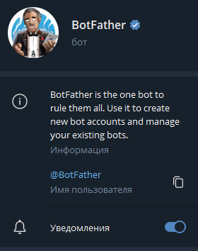
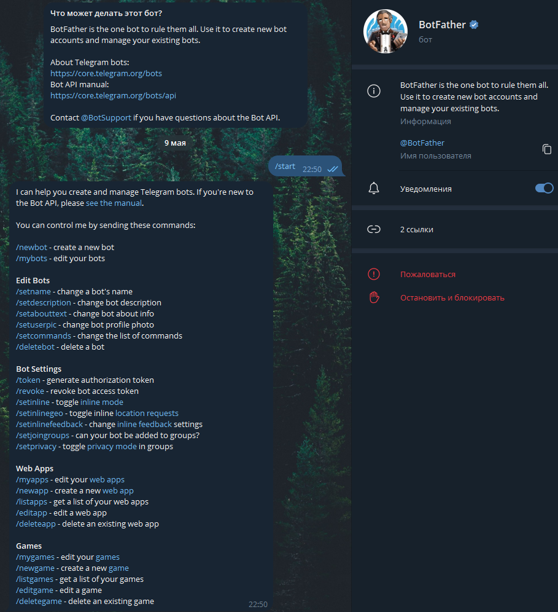
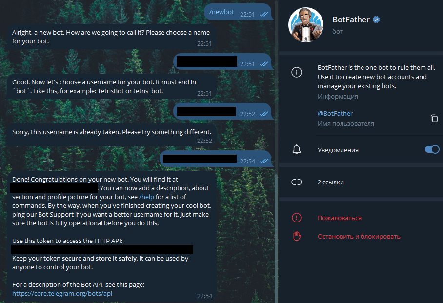

# Telegram Bot Binance Parser
This Telegram bot is designed to parse cryptocurrency rates from the [Binance](https://www.binance.com/en/markets/overview) website. 
It operates using three services, launched in Docker containers.

## Bot Functions
### Set Notification
You can select a cryptocurrency pair and set a notification type from the following options:

- **When Exceeds:** The bot will notify you when the current rate of the cryptocurrency pair exceeds the specified value. 
If the rate is already above the specified value, the notification will be sent immediately.

- **When Below:** The bot will notify you when the current rate of the cryptocurrency pair falls below the specified value. 
If the rate is already below, the notification will be sent immediately.

- **When Crosses:** The bot checks the current rate and, depending on its value relative to the specified one, 
will send a notification when crossing that value.

You need to specify the value for the notification condition. 
The bot will provide the current rate of the selected cryptocurrency pair.

Then, when the condition is met, the bot will send you a notification.

### Get Current Rate
Select a cryptocurrency pair, and the bot will provide information about the current rate.

---
## Implementation
The bot consists of three services running in Docker containers:

- **Bot:** Handles user interaction, sends and receives messages in Telegram, 
transmits data to the `Parser` service, and sends notifications to the user.

- **Parser:** Receives messages from the `Bot` service, checks notification conditions, 
and sends messages back to the `Bot` service when they are met.

- **rabbitmq:** Implements a message queue between the `Bot` and `Parser` services.

---
## Installation
### Install and Configure `Docker`
Install `Docker` following the instructions for your OS:

- [Installation on Windows 10](https://docs.docker.com/desktop/install/windows-install/)

- [Installation on Linux Ubuntu](https://docs.docker.com/engine/install/ubuntu/)

- [Installation on Mac](https://docs.docker.com/desktop/install/mac-install/)

Create a network in `Docker`:
```bash
$ docker network create rabbitnet
```

### Install and Configure `RabbitMQ`
Run `rabbitmq` and connect it to the network:
```bash
$ docker run -d --rm --network rabbitnet -p 5680:15672 --hostname rabbit-1 --name rabbit rabbitmq
```

### Install and Configure `Telegram` Bot
1. Create a bot using [@BotFather](https://t.me/BotFather).
   First, you need to create a bot in `Telegram`. This is done using the special bot [@BotFather](https://t.me/BotFather).

   

   Then you need to start it so it can send you the first message:

   

   To create a bot, you need to enter the command:
   ```
   /newbot
   ```

   Then you need to give the bot a name, followed by a `username`.

   > `Note`: The `username` must end with `Bot` or `bot` and it must be unique.

   As a result, [@BotFather](https://t.me/BotFather) will inform you that the bot was successfully created and will also send you its token.

   

2. Configure the bot service

   Before running the bot, you can configure its message map.

   [Guide on creating and configuring the message map](Bot/MESSAGE_MAP_GUIDE.md).

3. Run the bot service

   Navigate to the `path/to/BinanceParser/Bot` directory and execute the following commands:
   ```bash
   $ cd path/to/BinanceParser/Bot
   
   $ docker build . --tag binance_telegram_bot
   $ docker run -d --network rabbitnet --name snt_binance_telegram_bot binance_telegram_bot --token your_telegram_bot_token
   ```

### Install and Configure `Binance` Parser
Navigate to the `path/to/BinanceParser/Parser` directory and execute the following commands:
```bash
$ cd path/to/BinanceParser/Parser

$ docker build . --tag binance_parser
$ docker run -d --network rabbitnet --name snt_binance_parser binance_parser
```

---

After completing all the steps, the bot will be ready to use.